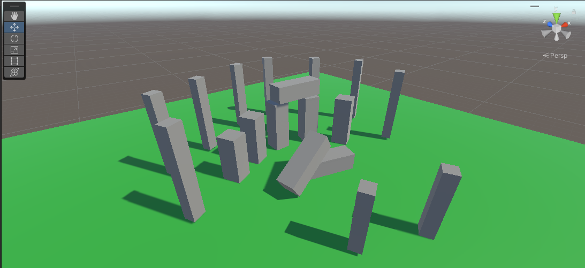
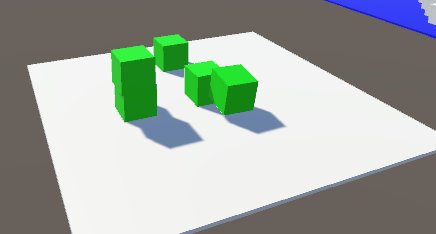
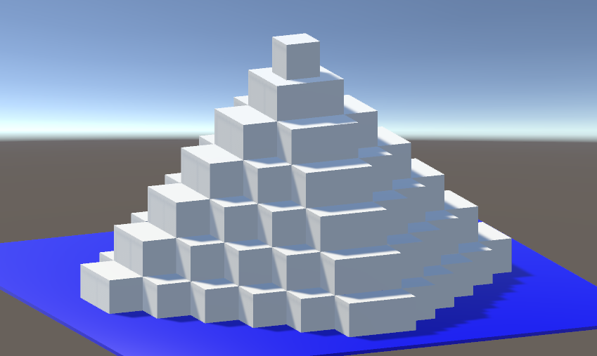
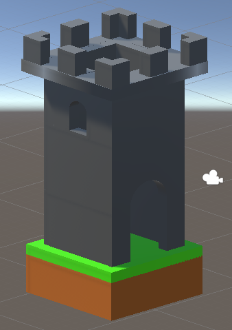

# Projektowanie-gier-w-srodowisku-UNITY

## Student

- Imię i nazwisko: Dominik Lewczyński
- Numer albumu: 155099

### Ćwiczenie 1

- Poznanie czym jest UNITY
- Zapoznanie się interfejsem środowiska pracy
- Wykonanie zadań do wykonania
  

### Ćwiczenie 2

- Poznanie informacji o obiektach oraz komponentach w UNITY
- Wykonanie zadań

  - Obiekty gry i komponenty.

    - Zadanie 1 - tak ✅
    - Zadanie 2 - tak ✅
    - Zadanie 3 - tak ✅

    

    - Zadanie 4 - tak ✅

    

  - Prefabrykaty

    - Zadanie 1 - tak ✅
    - Zadanie 2 - tak ✅
    - Zadanie 3 - tak ✅
    - Zadanie 4 - tak ✅
    - Zadanie 5 - tak ✅
    - Zadanie 6 - tak ✅
    - Zadanie 7 - tak ✅
    - Zadanie 8 - tak ✅
    - Zadanie 9 - tak ✅

    

### Ćwiczenie 3

- Poznanie informcji o API i dodawaniu własnych skryptów
- Wykonanie zadań:
  - Zadanie 1 - tak ✅.
  - Zadanie 2 - tak ✅
  - Zadanie 3 - nie ❌
  - Zadanie 4 - tak ✅
  - Zadanie 5 - nie ❌
  - Zadanie 6 - tak ✅

### Ćwiczenie 4

- Skrypty w Unity ciąg dalszy.
- Wykonanie zadań:
  - Zadanie 1 - tak ✅
  - Zadanie 2 - tak ✅
  - Zadanie 3 - tak ✅
  - Zadanie 4 - tak ✅

### Ćwiczenie 5

- Zadanie specjalne polegające na stworzeniu trójwymiarowego modelu Naszego wyboru za pośrednictwem oprogramowania Mechroom oraz Blender lub innego pozwalającego na edycję modeli 3D
- Czy zadanie wykonane? - nie ❌
