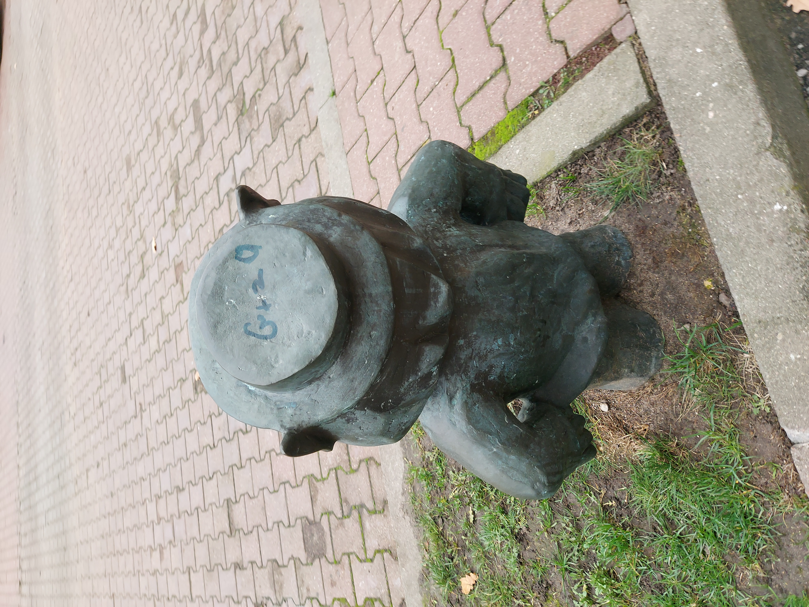

# Wykonane zadanie specjalne

Model przedstawia mały posąg zwany inaczej Pofajdokiem, którego można znależć w Szczytnie. Do wykonania modulu Pofajdoka wykorzystano 34 zdjecia z wykonanych 155.

Tak wygląda model w blenderze

Linki do plików
- Model wykonany w Meshroom -> [link](./obierzyswiat.mg)
- Model wykonany w Blenderze -> [link](./Pofajdok_Biznesman.zip)

A tak wygląda model Pofajdoka w rzeczywistości:

